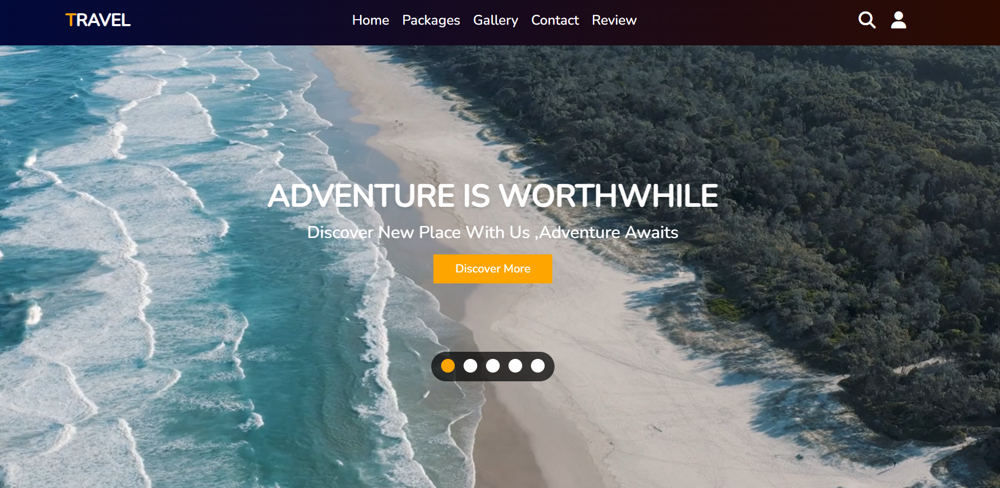
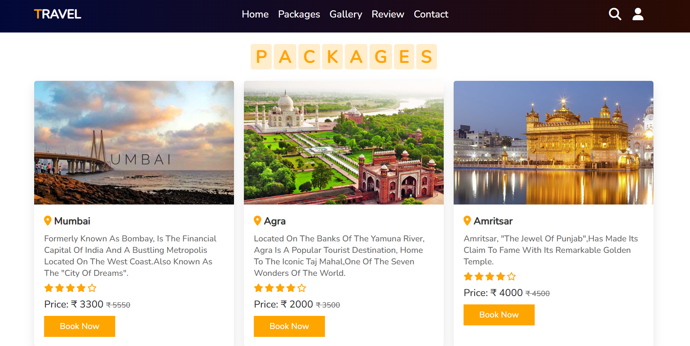

# 🌍 Travel Website

A modern and visually appealing Travel Landing Page showcasing beautiful destinations and encouraging travel exploration. Built using HTML, CSS, and JavaScript.

## 🖼️ Screenshots

### 🏠 Home Page

### 📅 Package Preview

## 🚀 Live Demo

👉 [View Live App](https://travel-jet-xi.vercel.app/)

> *(Replace the above link with your actual Vercel URL after deployment)*

---

## 📂 Features

- 🖼️ Hero section with call-to-action
- 📷 Image gallery of travel destinations
- 🧭 Easy navigation menu
- 📱 Responsive design for all devices
- 💡 Simple, clean, and attractive layout

---

## 🛠️ Built With

- HTML5
- CSS3
- JavaScript
- [Vercel](https://vercel.com) for deployment

---

## 🧾 How to Use Locally

# 1. Clone the repository
git clone https://github.com/Agraj2002/travel.git

# 2. Navigate into the project folder
cd travel-website

# 3. Open in browser (if index.html present)
open index.html  # or just double-click on index.html
